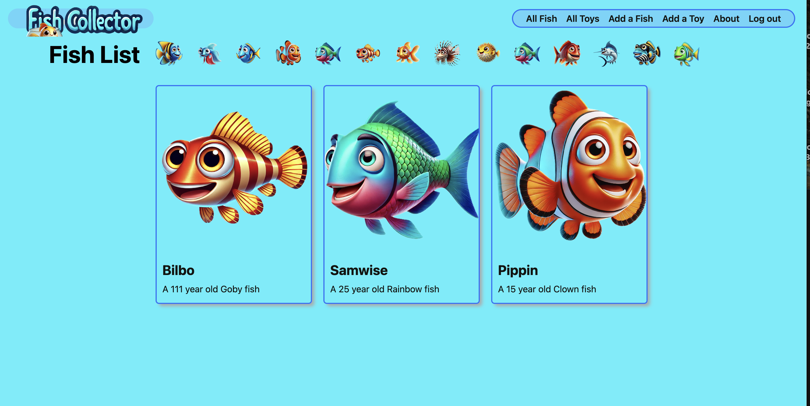
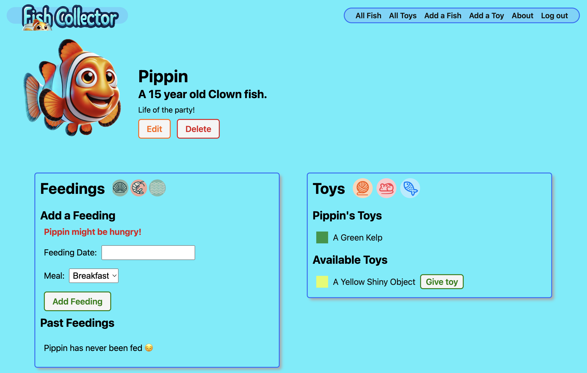

# Fish Collector

# Welcome to Fish Collector!
I'm a 90s kid, so please enjoy this nostalgic, digital twist on the Tamagotchi Pets of my childhood. Collect colorful fish of your choosing and have fun adding feedings and toys to various fish you own!

## Key Features
* Sign up and upload a photo for each fish to keep track of your animals.
* Create new fish to add to your menagerie.
* Add 3 feedings each day to keep your fish healthy.
* Give and create toys to the fish you create.

## About the creator [Ito Aghayere](https://github.com/Incogn-ito) 

## Technologies Used

### Full Stack:
      

### Other Technologies:
        

### Development Tools:
    

## Attributions
* [Chatgpt](https://chatgpt.com/) - Images

# Next Steps
* Give user ability to upload self-selected photos  
* Add delete toy functionality
